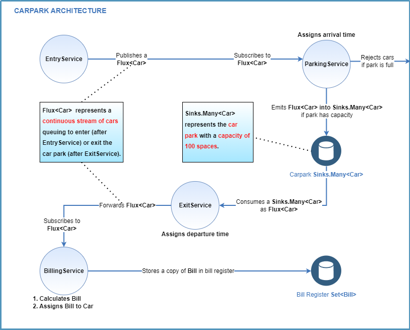

# Overview

Carpark is a highly concurrent parking application written in Java's [Project Reactor](https://projectreactor.io/) powered by Java 20 and [Spring-Boot](https://spring.io/projects/spring-boot). It is scalable to many threads and adapts to the number of cores on the host machine. This implementation is fully unit and integration tested.

## Application Design

### Rationale

To model the carpark, I went with reactor's persistent store [Sinks.Many](https://projectreactor.io/docs/core/release/api/reactor/core/publisher/Sinks.Many.html) backed by a bounded blocking double-ended queue (effectively non-blocking). I considered using the highly optimised cache provider [Caffeine](https://github.com/ben-manes/caffeine) as an alternative, which is concurrent, highly scalable, and provides near-optimal efficiency within the JVM. However, I preferred to stay within the reactive ecosystem.

To model car arrivals and departures, I chose [Project Reactor](https://projectreactor.io/). I considered simpler imperative Java and Java8 streams, but reactor is best-in-class for highly concurrent publisher/consumer scenarios. For this project, car arrivals are modeled by publishing events, and car departures by consuming events. 

Furthermore, Reactor: 

- Allows for fast and scalable concurrency with minimal setup. 
- Provides native [backpressure](https://www.baeldung.com/reactor-core#backpressure). 
- Is easily testable via `reactor-testing library` (testing imperative multi-threaded programs is otherwise very difficult)
- Can be monitored for performance bottlenecks via [Reactor Metrics](https://projectreactor.io/docs/core/release/reference/#metrics).

To model the bill register (where copies of `Bills` are stored once issues to `Cars`), I chose the fast and thread-safe Set implementation `java.util.concurrent.ConcurrentHashMap`

### Architecture



## Run Instructions

*Note*: this project requires a valid distribution of Java20, such as [OpenJDK](https://jdk.java.net/20/).

You can run the application via an IDE. The IDE used for development and testing is [IntelliJ IDEA](https://www.jetbrains.com/idea/) version `2023.1.1 (Community Edition)`.
> [CarparkApplication](src/main/java/com/acerasoni/carpark/CarparkApplication.java)

Alternatively, you can run the application directly through a CLI using Spring-Boot's [Maven Plugin](https://docs.spring.io/spring-boot/docs/current/reference/html/build-tool-plugins.html#build-tool-plugins.maven)
```bash
./mvnw spring-boot:run
```

## Problem Statement

- When a car comes in, check if there is a space available, otherwise return a message saying it is full.
- There are 100 spaces available in the car park.
- Multiple cars may come in at the same time
- The solution must be similar to production code

## Assumptions

For the purpose of this simulation, I have made the following assumptions, which may be modified through the [application.properties](src/main/resources/application.properties).

- A new car appears every 120 milliseconds
- Cars stay parked for 150 milliseconds
- The simulation lasts 20 seconds
- The simulation is sped up by a factor of 7,200 (such that, in billing terms, 500 milliseconds equal 1 hour)
    > To run the simulation at normal speed, set `carpark.speed-up-factor=7200`
- The currency is GBP

## Extensions

This application is built to be as similar as possible to a production-ready MVP. However, given more time, one could implement the following:

- Containerising the application for easy deployment
- Use user input to simulate car arrivals for a more realistic feel
  > Alternatively, configure cars to arrive at a random frequency rather than a fixed one
- Configure cars to depart at a random frequency rather than a fixed one
- Tracing via logs
- Emit logs to an aggregator for efficient searching (i.e. [ELK Stack](https://auth0.com/blog/spring-boot-logs-aggregation-and-monitoring-using-elk-stack/)) 
- Monitor performance and bottlenecks via [reactor-core-micrometer](https://projectreactor.io/docs/core/release/reference/#metrics)
- 360° observability (including alerting) via Prometheus, Micrometer and Grafana
- Add JavaDocs
